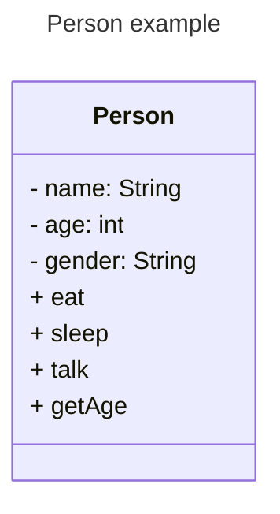
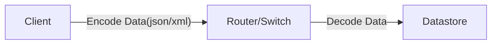

# What is a data model

In simple terms , its the information/data used to define something .

For example , this something is a Person . So how do we define a person .

This Data Model has 2 types of data :

1.  Attributes(-) : which basically means how to identify the person. We identify a person by their name ,gender and Age .
   
3.  Methods (+): This type of data talks about what actions can this person perform . Eat,Sleep,talk

### Why Datamodels
Datamodels is to used for the following reasons :

1.  Create structure for the data
2.  Standardise approach for consistency
3.  Organize the elements 
4.  Define the relationship between one another data

Going back to previous example
Create structure , means we identified data as 2 distinct catagories (Attributes/Methods) . So all data about the person should fall in one of these 2 catagories .

Once the data is standardized , it helps everyone/system interacting with the datamodel . This helps provide consistency while using this datamodel , means one knows for sure the the gender of the person will either be male/female . So I get then get a list of people who are male .

Organize the data , again helps with stability and reliability .

Define the relationship can be the person like to eat Biryani , which is a different model consisting of its own attributes(ingridents) and methods (recipe).

## Data Model Description
Its the formal language used to describe data models .
   
   example : SNMP,YANG,SQL DDL,XML Schema

We use the description to define and validate the data

## Data Store
Its where the actual data is stored

    example : excel,text file , relational database , no SQL database

## Data Representation
Mechanism to encode complex data structures. 
Data is transmitted from client to server so that the data even during transmission is consistent .

    example : XML,json,yaml,snmp

