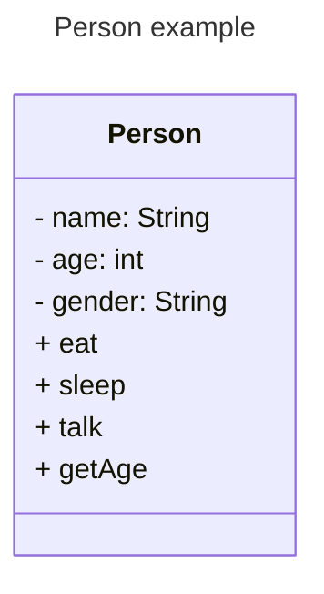

# What is a data model

In simple terms , its the information/data used to define something .

For example , this something is a Person . So how do we define a person .

This Data Model has 2 types of data :

1.  Attributes(-) : which basically means how to identify the person. We identify a person by their name ,gender and Age .
   
3.  Methods (+): This type of data talks about what actions can this person perform . Eat,Sleep,talk

